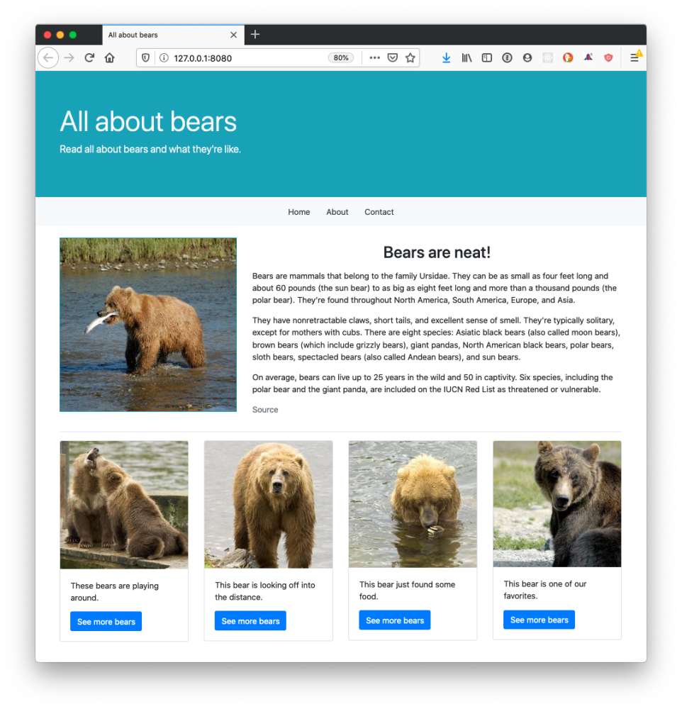
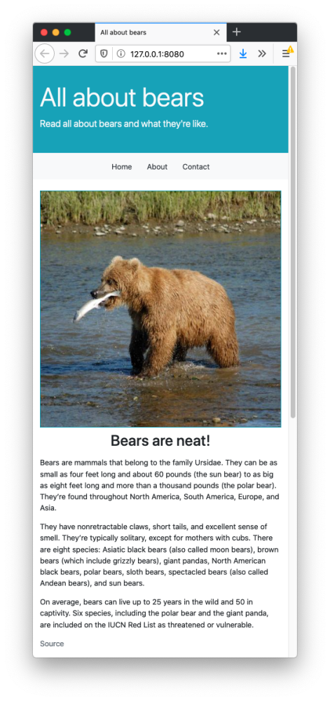
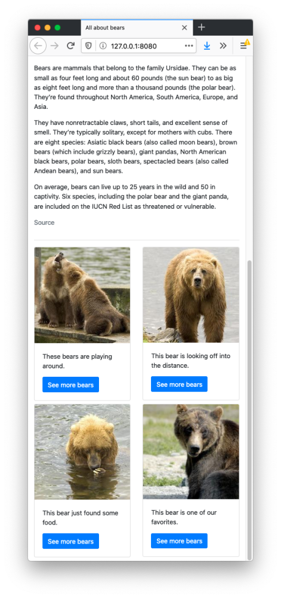

# CSS Frameworks: Assignment

## Instructions

To complete this assignment, you will need to build a website that looks similar to the one shown below. Your website _must_ conform to the following constraints:

- It must 100% rely on Twitter Bootstrap. You may have _no_ custom CSS.
- It should have a similar layout and color scheme to the example below.
- It should be responsive, as show below.

Your website does _not_ need to have the exact same content. You will be graded based off of your ability to recreate the layout, not your ability to use the exact text and images seen here.

### Desktop view

On a desktop, your website should look similar to the following. You can use the `md` breakpoint when deciding upon classes.



### Mobile view

On a smaller device, your layout should look similar to the following.





### Image resources

You are welcome to use whatever appropriate images you like. If you would like to use different bear content, you can use these [images from National Geographic](https://www.nationalgeographic.com/animals/mammals/group/bears-grizzly-polar-panda/) of several types of bears. Or maybe you'd like to use [these photos of kittens](http://placekitten.com/)! 

To use the images seen above, use the links below. You can also find the photos in the *Bear Images* folder in this repository.

```
https://placebear.com/490/480
https://placebear.com/225/225
https://placebear.com/225/224
https://placebear.com/225/223
https://placebear.com/225/222
```
